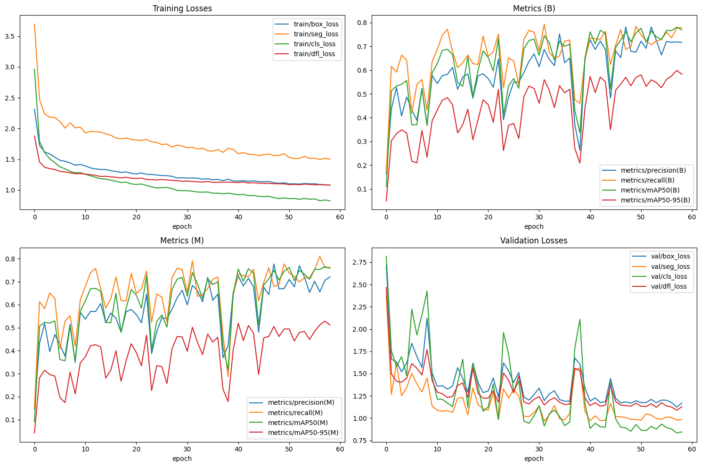

# Document2Braille
## Final project in Digital Image Processing and Machine Learning.
A project to convert images containing text into Braille. 

## Authors

1. **Thai Thi Kim Yen** - *Student ID: 47.01.104.250*
2. **Hoang Thuy Quynh Huong** - *Student ID: 47.01.104.096*

### Lecturer: Dr. NGO QUOC VIET (Thầy Việt dễ thương)

## Installation
```
git clone <https://github.com/Sherlockian1212/Document2Braille.git>
```

## Usage

### Install Tesseract-OCR

#### Ubuntu
```commandline
sudo apt install tesseract-ocr
sudo apt install libtesseract-dev
```
#### macOS
To install Tesseract run this command:
```commandline
sudo port install tesseract
```
To install Vietnamese language data, run:
```commandline
sudo port install tesseract-vie
```

#### Windows
Installer for Windows for Tesseract 3.05, Tesseract 4 and Tesseract 5 are available from [Tesseract at UB Mannheim](https://github.com/UB-Mannheim/tesseract/wiki). These include the training tools. Both 32-bit and 64-bit installers are available.

An installer for the OLD version 3.02 is available for Windows from our [download](https://tesseract-ocr.github.io/tessdoc/Downloads.html) page. This includes the English training data. If you want to use another language, [download the appropriate training data](https://tesseract-ocr.github.io/tessdoc/Data-Files.html), unpack it using [7-zip](http://www.7-zip.org/), and copy the .traineddata file into the ‘tessdata’ directory, probably `C:\Program Files\Tesseract-OCR\tessdata`.

To access tesseract-OCR from any location you may have to add the directory where the tesseract-OCR binaries are located to the Path variables, probably `C:\Program Files\Tesseract-OCR`.

Experts can also get binaries build with Visual Studio from the build artifacts of the [Appveyor Continuous Integration](https://ci.appveyor.com/project/zdenop/tesseract/history).

### Install the necessary packages

```
pip install -r requiments.txt
```

### Runing server in local host
```
python app.py
```

## Methods
### 1. Image Pre-Processing


### 2. Document Image Segmentation

YOLO is a high-accuracy, fast-speed model that utilizes the pre-trained YOLOv8 model. It has been retrained on a dataset collected from 9th-grade Mathematics and Biology textbooks, which was labeled by Hà, Vy, and Yến.

This dataset comprises a total of 2149 images and has undergone a series of preprocessing steps. In this process, we applied the following steps: Preprocessing (Auto-Orient, Resize stretch to 640x640)
Augmentations (Crop, Rotation, Shear, Grayscale, Cutout, Mosaic, Brightness, Blur). These steps aim to optimize the input data for the model training process. Dataset split: 88% for the training set, 8% for the validation set, and 4% for the test set.


#### Data Visualization


#### Training



#### Testing


### 3. Text Extraction


### 4. Convert to Braille
The Ministry of Education and Training has issued a Circular on "Ban hành Quy định chuẩn quốc gia về chữ nổi Braille cho người khuyết tật". It clearly outlines the principles and rules for writing Braille in the Vietnamese language. The provisions in the Circular are applied to convert the recognized and processed Vietnamese characters in the previous steps.

## Contributing

Pull requests are welcome. For major changes, please open an issue first
to discuss what you would like to change.

Please make sure to update tests as appropriate.

## References
[1] Ngô Quốc Việt. (2017). Xử lý ảnh số. NXB ĐHSP Tp.HCM.

[2] Ngô Quốc Việt. Digital Image Processing lecture slides. (Bài giảng của thầy Việt dễ thương)

[3] Phan Đức Chính, Tôn Thân, Vũ Hữu Bình, Trần Phương Dung, Ngô Hữu Dũng, Lê Văn Hồng, Nguyễn Hữu Thảo. Sách giáo khoa Toán lớp 9 Tập 1. Nhà xuất bản Giáo Dục Việt Nam.

[4] Phan Đức Chính, Tôn Thân, Nguyễn Huy Đoan, Phạm Gia Đức, Trương Công Thành, Nguyễn Duy Thuận. Sách giáo khoa Toán lớp 9 Tập 2. Nhà xuất bản Giáo Dục Việt Nam.

[5] Tôn Thân, Vũ Hữu Bình, Trần Phương Dung, Lê Văn Hồng, Nguyễn Hữu Thảo. Bài tập Toán 9 Tập 1. Nhà xuất bản Giáo Dục Việt Nam.

[6] Tôn Thân, Phạm Gia Đức, Trương Công Thành, Nguyễn Duy Thuận. Sách giáo khoa Toán lớp 9 Tập 2. Nhà xuất bản Giáo Dục Việt Nam.

[7] Nguyễn Quang Vinh, Vũ Đức Lưu, Nguyễn Minh Công, Mai Sỹ Tuấn. Sách giáo khoa sinh học 9. Nhà xuất bản Giáo Dục Việt Nam.

[8] Bộ Giáo dục và Đào tạo. (2019). Thông tư số 15/2019/TT-BGDĐT ban hành Quy định
chuẩn quốc gia về chữ nổi Braille cho người khuyết tật.

[9] S.V. Rice, F.R. Jenkins, T.A. Nartker. (1995). The Fourth Annual Test of OCR Accuracy,
Technical Report 95-03, Information Science Research Institute, University of Nevada, Las
Vegas.

## License

[MIT](https://choosealicense.com/licenses/mit/)